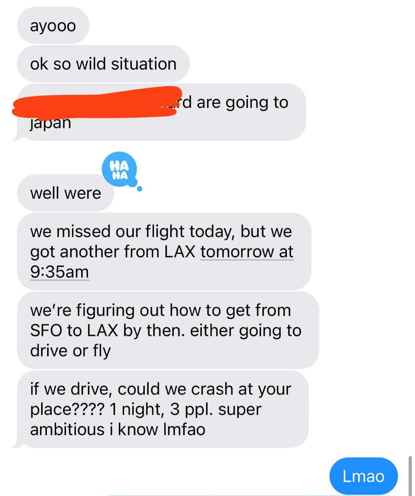

# cooked

## Inspiration

After missing many flights of our own and having friends deal with the situation of missing/cancelled/delayed flights interfering with plans, we decided to build cooked.

When a flight is missed or delayed, the possible alternatives are very open-ended, and traditional travel search engines aren't sufficient. Under the constraints of a missed/delayed flight situation, the scope of possibile options expands to the extent that an AI-agent model might actually be the best solution — a dynamic tool that can think of options like driving to nearby airports, taking public transit or buses, or even repositioning to a completely new city.

## What it does

1. Enter in your flight number
1. We call fetch.ai's DELTA-V Chat API with the prompt in `cloud-cooked/convex/actions.ts`
1. Given agents that we've already set up on fetch.ai's [agentverse](https://agentverse.ai/), we ask DELTA-V to respond to our prompt, finding you alternative routings for your flight including buses, trains, public transit, etc. There is no coding needed on our end besides the prompt — DELTA-V automatically determines the best agents to complete the task, then queries the APIs it needs to come up with a plan.

   - Agent code is in `agents/` folder

1. The alternate plan is displayed to the user.
1. If the user likes the alternate plan, we have another prompt that is sent to DELTA-V which allows the user to book all the tickets (stretch goal).

## How we built it

- fetch.ai to determine which agents to use
- Convex to keep track of fetch.ai DELTA-V chatbot sessions on a per-tab basis
- Next.js/Vercel for hosting
- Figma to design the frontend
- Tailwind to style the frontend

## Challenges we ran into

- Finding good APIs for data
- Dealing with DELTA-V API expiration

## Accomplishments that we're proud of

- Very nice looking frontend, with design files in Figma
- We were able to write a relatively stable wrapper around the DELTA-V API with nice abstractions to make accessing messages easier
- Diverse set of agents able to complete a wide variety of tasks
- Well-engineered prompt for DELTA-V

## What we learned

- Prompt engineering
- Advanced Tailwind classes
- Convex and fetch.ai concepts

## What's next

- Getting flight delay prediction working with a weather/airport delay agent
- Getting non-flight alternatives working with a public transit/train agent

## For developers

### Getting started

1. Install dependencies: `bun install`
1. Start Next.js dev server: `bun dev`
1. Start Convex dev server: `bunx convex dev`

### Debugging

- If the call to fetch.ai fails, you probably need to get a new authentication token. Log out and log back into the fetch.ai [API docs](https://fetch.ai/docs/apis/ai-engine/chat), then copy the JWT and replace the `FETCH_AI_AUTH_TOKEN` [environment variable in Convex](https://dashboard.convex.dev/t/shrey150/cloud-cooked/posh-crane-176/settings/environment-variables) (in the `dev` environment)
